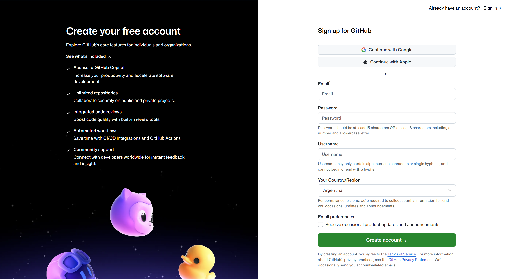
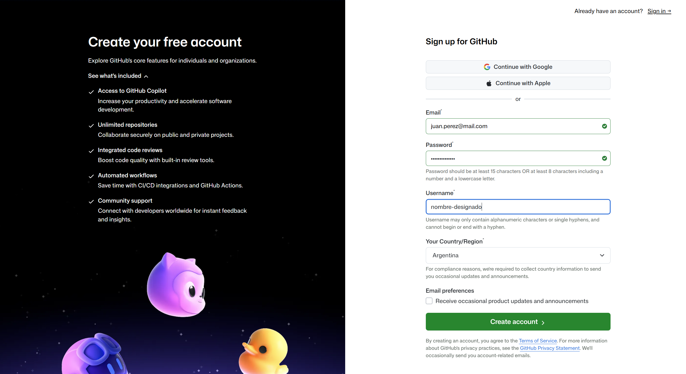
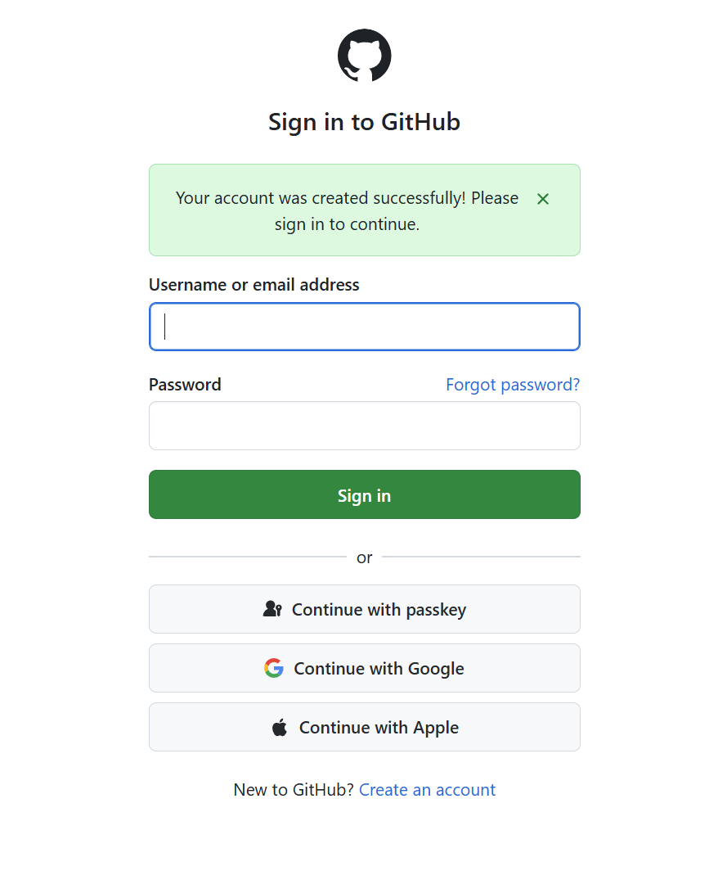
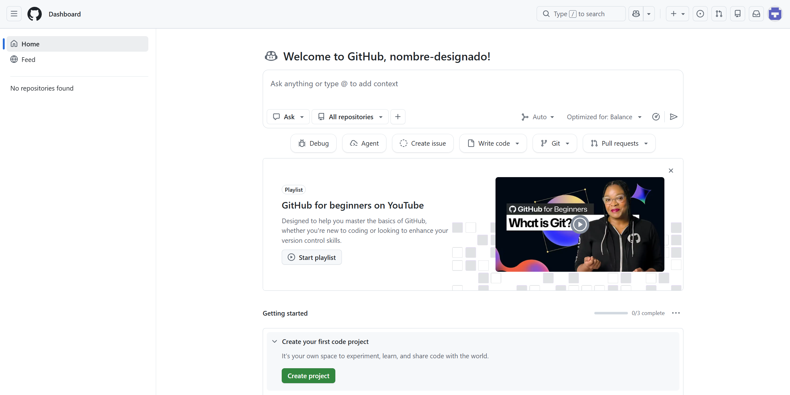

# Guía: crear una cuenta en GitHub

GitHub es una plataforma para alojar proyectos, organizar archivos y trabajar con repositorios. A continuación, el instructivo con los pasos para crear una cuenta nueva en GitHub.

## Antes de empezar

Vas a necesitar:

- Una dirección de correo electrónico a la que tengas acceso.
- Una contraseña segura.
- Un nombre para el proyecto que vas a desarrollar durante la cursada.

> **Nota:** podés utilizar cualquier cuenta de correo electrónico personal. Pero para el nombre de usuario de GitHub, la sugerencia es utilizar el nombre del proyecto asignado para el ejercicio (o una versión abreviada).

## 1. Abrir la página de registro

Ingresá a [github.com/signup](https://github.com/signup).

GitHub ofrece distintas formas de crear una cuenta:

- **Continue with Google**: continuar con una cuenta de Google.
- **Continue with Apple**: continuar con una cuenta de Apple.
- Registro manual: completar un correo electrónico, una contraseña y un nombre de usuario.

En esta guía mostramos el registro manual. Si preferís usar Google, seleccioná **Continue with Google** y seguí las instrucciones que aparezcan en pantalla.

## 2. Completar los datos de la cuenta

Completá los campos del formulario:

- **Email:** ingresá un correo electrónico válido al que puedas acceder.
- **Password:** elegí una contraseña segura que cumpla los requisitos indicados por GitHub.
- **Username:** escribí el nombre que le asignaste a tu proyecto (breve y sin espacios ni caracteres especiales). Puede ser el nombre designado o un nombre cualquiera que remita al proyecto.
- **Your Country/Region:** seleccioná tu país o región.

El nombre de usuario puede ser inventado, pero debe estar disponible y respetar las reglas de GitHub (no puede comenzar ni terminar con un guion).

En el ejemplo aparece `nombre-designado`. Ese texto es solamente ilustrativo: cada estudiante debe reemplazarlo por el nombre elegido para su propio proyecto.

La opción **Receive occasional product updates and announcements** es voluntaria y permite recibir novedades de GitHub por correo electrónico.

Cuando hayas completado el formulario, seleccioná **Create account** (crear cuenta).

## 3. Confirmar la dirección de correo

GitHub puede solicitar que confirmes la dirección de correo utilizada. En ese caso, aparecerá una pantalla con varios casilleros para ingresar un código.

Revisá la bandeja de entrada del correo utilizado durante el registro. GitHub enviará un mensaje con un código de lanzamiento. Copiá ese código en los casilleros de la pantalla y seleccioná **Continue** (continuar).

Si el mensaje no llega, podés seleccionar **Resend the code** (reenviar el código) o **update your email address** (actualizar la dirección de correo).

> **Importante:** los códigos y enlaces de verificación son personales y de un solo uso. No los compartas con otras personas.

La imagen del correo incluida en esta guía es un ejemplo recreado con valores ficticios. En tu caso, el código será diferente.

## 4. Iniciar sesión

Una vez confirmada la dirección, GitHub informará que la cuenta fue creada correctamente y solicitará iniciar sesión.

Ingresá tu **Username or email address** (nombre de usuario o correo electrónico) y tu **Password** (contraseña). Después, seleccioná **Sign in** (iniciar sesión).

También pueden aparecer otras formas de acceso, como passkey, Google o Apple. Para este recorrido, utilizá el método con el que registraste la cuenta.

> No compartas tu contraseña ni códigos de acceso en capturas, chats o entregas.

## 5. Verificar que la cuenta esté activa

Después de iniciar sesión, GitHub mostrará el panel principal o **Dashboard**.

En la parte central aparecerá un mensaje de bienvenida con tu nombre de usuario. En el ejemplo se lee `nombre-designado`, pero cada estudiante verá allí el nombre que haya elegido para su propio proyecto.

Al principio es normal que todavía no aparezcan repositorios. El siguiente paso de trabajo será crear o vincular el repositorio correspondiente al proyecto de la asignatura.

## Recomendaciones para el perfil

Si más adelante GitHub solicita completar una descripción, una biografía o información pública del perfil:

- Priorizá información relacionada con el proyecto.
- Evitá publicar datos personales innecesarios.
- No incluy contraseñas, códigos de verificación ni enlaces privados.
